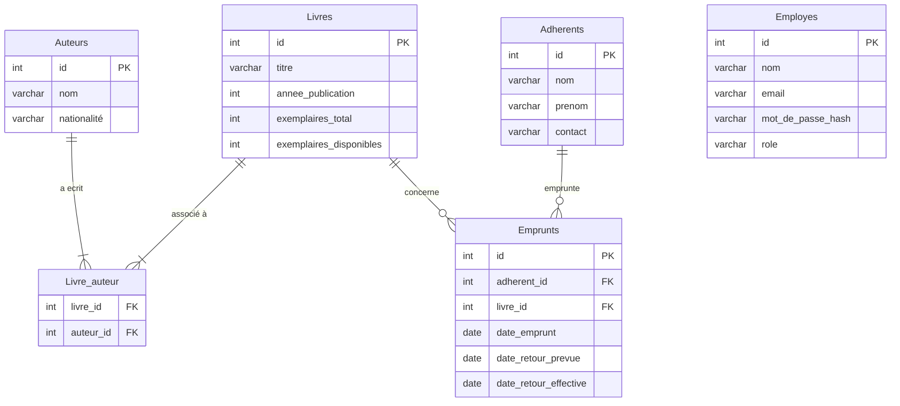

# s-14-bibliotheque
## logique de la base de données
### diagramme entitées relations.


## Tester le projet en local.

1. **clonez le repo git:**
```shell 
git clone https://github.com/Inissub/s-14-bibliotheque.git
```
2. creer une base de donnée sur postgresql `bibliotheque` et y importer le fichier `biblio.sql`. Une fois cela fait, créez le fichier `.env` , à l'image du fichier `.env.example`

3. **installation des packages**
```bash
npm install
```
4. **lancer le serveur**
```bash
npm run dev
```
5. ouvrir l'adresse http://localhost:3000 dans le navigateur


